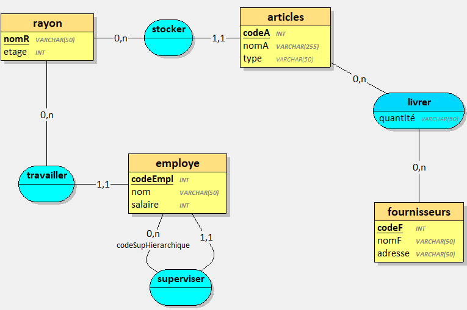
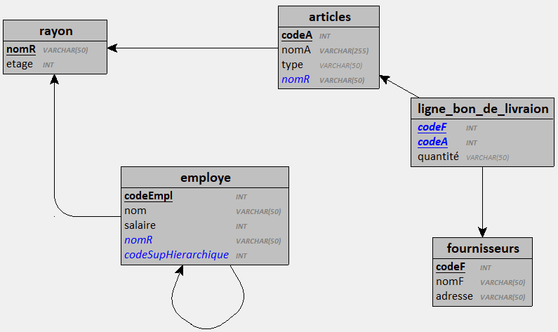

# Fournisseurs

## Docker 

Créer l'image :

`docker build -t neihren/db-exo-fournisseurs . `

Créer le conteneur :

`docker run -d -p 4012:3306 -v exo-fournisseurs-data:/var/lib/mysql --name exo-fournisseurs-database neihren/db-exo-fournisseurs`

## Base de données 

## Requêtes à implémenter 

/* 1. Sélectionner tous les employés (codeEmpl, nom, salaire) triés par nom et par ordre alphabétique */ 

/* 2. Sélectionner tous les employés (codeEmpl, nom, salaire) avec, pour chaque employé, le nom du rayon dans lequel il travaille */

/* 3. Sélectionner tous les fournisseurs (codeFourn, nom) et le nombre de produits qu'ils fournissent, triés par nombre de produits décroissant */

/* 4. Sélectionner le nom des produits, leur prix, et le nom du fournisseur associé */

/* 5. Sélectionner le nom des produits, leur prix, et le nom du fournisseur pour chaque produit dont le prix est supérieur à la moyenne des prix des produits */

/* 4. Sélectionner tous les employés (codeEmpl, nom). Pour chaque employé, indiquer le nom du rayon, le nombre d'articles associés au rayon  */

/* 5. Sélectionner tous les articles (codeA, nomA). Pour chaque article, indiquer le nombre de livraisons et la quantité totale livrée. */

/* 6. Sélectionner tous les articles (codeA, nomA). Pour chaque article, indiquer le nom du fournisseur, le nom et l'étage du rayon où il est stocké, et l'employé qui y travaille (codeEmpl, nom). */
